<div align="center">

# YOLOspine

### A Clinically Validated Hierarchical Two-Stage Attention-Enhanced Architecture for Multi-Label Overlapping Spinal Disorder Detection

[](LICENSE)
[](https://python.org)
[](https://pytorch.org)
[](https://data.mendeley.com/datasets/9j9hmy8kbn/1)

**IEEE Transactions on Medical Imaging (TMI) 2026**

[Rao Farhat Masood](https://orcid.org/0000-0001-9054-9192) · [Imtiaz Ahmad Taj](https://orcid.org/0000-0003-1813-5563)

*Department of Electrical and Computer Engineering, Capital University of Science and Technology (CUST), Islamabad, Pakistan*

[**Paper**](#citation) · [**Dataset**](https://data.mendeley.com/datasets/9j9hmy8kbn/1) · [**Results**](#results)

</div>

---

## Highlights

- **84.90% mAP₅₀₋₉₅** on internal dataset (1,038 multi-disorder MRI images, 8,991 annotations)
- **79.08% mAP₅₀₋₉₅** on external cross-validation ([RSNA 2024 derivative](https://www.kaggle.com/competitions/rsna-2024-lumbar-spine-degenerative-classification/data), 300 images)
- **4.78% improvement** over the second-best model (YOLOv26m) and **22.25%** over RT-DETR
- **0.48s per scan** inference — 180× faster than expert clinicians (~90s)
- Clinically validated by 2 radiologists and 1 spinal surgeon across 350 images (2,994 annotations)
- Publicly available annotated [multi-disorder dataset](https://data.mendeley.com/datasets/9j9hmy8kbn/1) with 6 overlapping spinal pathologies

---

## Spinal Disorders

YOLOspine detects **six** spinal pathologies from T1/T2-weighted mid-sagittal lumbar MRI:

| Class ID | Abbreviation | Disorder | Annotations |
|:--------:|:------------:|:---------|:-----------:|
| 0 | **DDD** | Degenerative Disc Disease | 633 |
| 1 | **IVDₙ** | Normal Intervertebral Disc | 4,131 |
| 2 | **SS** | Spinal Stenosis | 1,921 |
| 3 | **SP** | Spondylolisthesis | 122 |
| 4 | **LDB** | Lumbar Disc Bulge | 2,033 |
| 5 | **TDB** | Thoracic Disc Bulge | 151 |

<div align="center">
<table>
<tr>
<td align="center">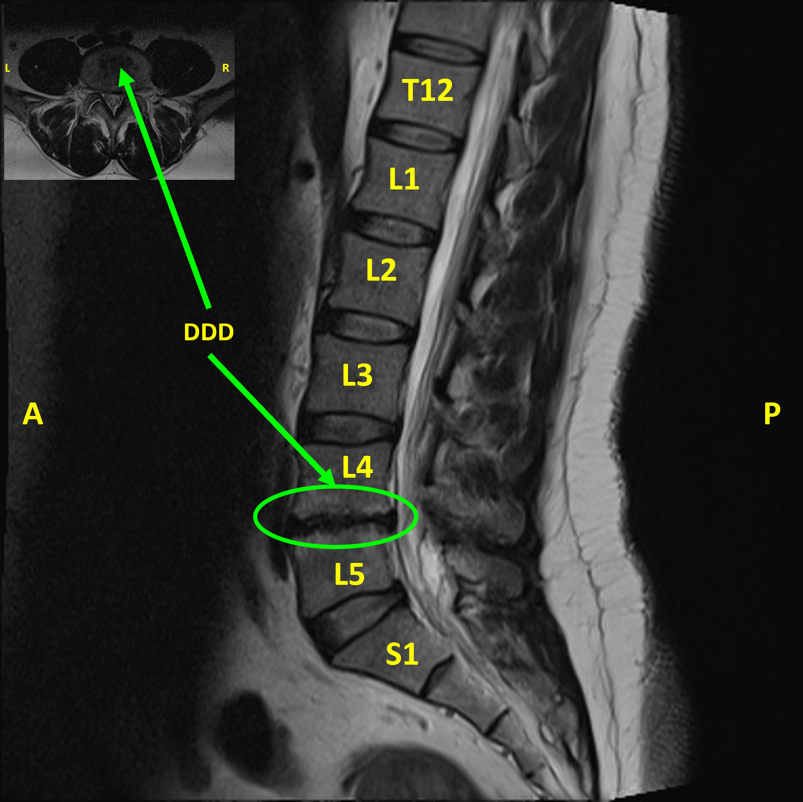<br/><sub><b>(a) DDD</b> — IVD height loss</sub></td>
<td align="center">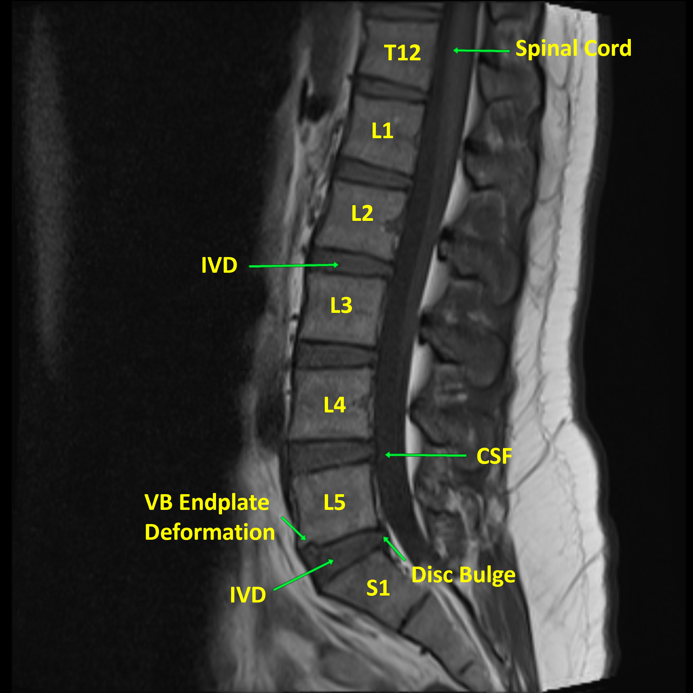<br/><sub><b>(b) LDB</b> — Disc Bulge</sub></td>
<td align="center">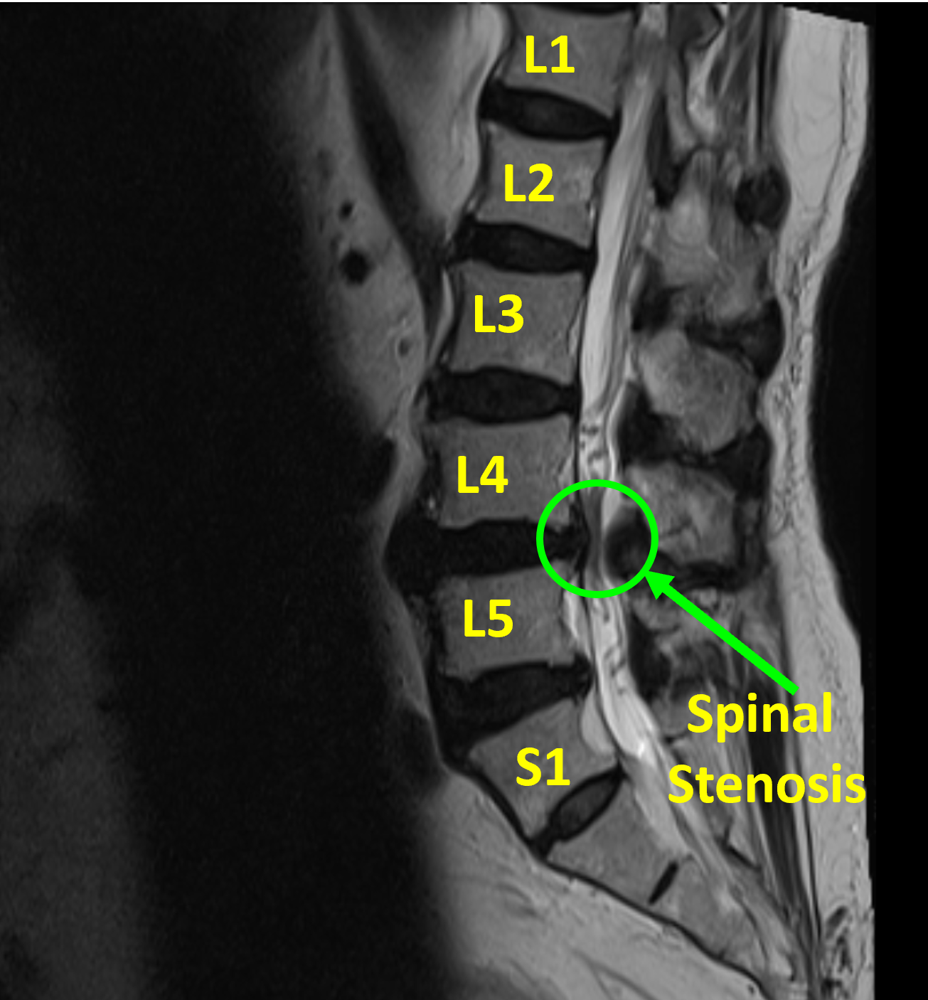<br/><sub><b>(c) SS</b> — Canal narrowing</sub></td>
<td align="center">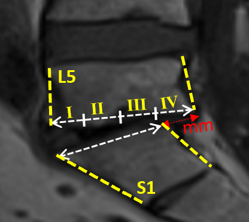<br/><sub><b>(d) Meyerding Grading</b> — SP</sub></td>
</tr>
</table>
</div>

### Overlapping Disorders

Lumbar spine disorders frequently co-occur at the same functional spinal unit (FSU). Our dataset contains **1,119 clinically validated overlapping disorder pairs** (49.3% of all pairs). A pair $(d_i, d_j)$ is classified as overlapping when **both** conditions are satisfied:

**(i) Anatomical Compatibility:**

$$\mathcal{A}(c_i, c_j) = \frac{|\{(\mathbf{b}, \mathbf{b}') : c(\mathbf{b}) = c_i \wedge c(\mathbf{b}') = c_j\}|}{\min(|S_{c_i}|, |S_{c_j}|)} \geq \tau_{\text{anat}}$$

**(ii) Spatial Overlap:**

$$\text{IoU}(\mathbf{b}_i, \mathbf{b}_j) \geq \tau_{\text{spatial}}$$

| Pathology Pair | τ_spatial | Overlapping Pairs | Mean IoU | A(cᵢ,cⱼ) |
|:---------------|:---------:|:-----------------:|:--------:|:---------:|
| SS + LDB | 0.18 | 869 | 0.184 | 0.91 |
| DDD + SS | 0.15 | 136 | 0.175 | 0.35 |
| SP + LDB | 0.35 | 78 | 0.376 | 0.98 |
| DDD + SP | 0.30 | 36 | 0.349 | 0.43 |

<div align="center">
<table>
<tr>
<td align="center">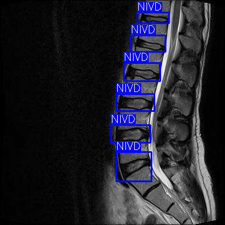<br/><sub><b>(a)</b> Healthy Lumbar Spine</sub></td>
<td align="center">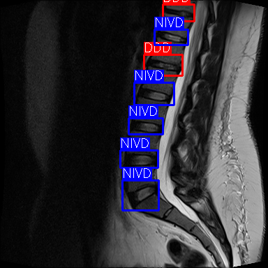<br/><sub><b>(b)</b> Non-Overlapping DDD</sub></td>
<td align="center">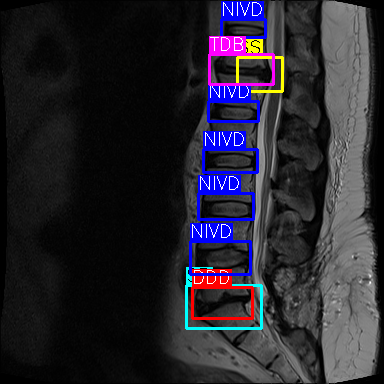<br/><sub><b>(c)</b> Multiple Overlaps</sub></td>
<td align="center">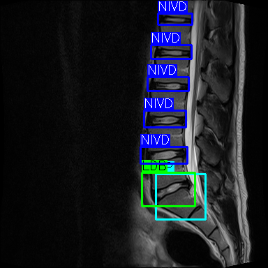<br/><sub><b>(d)</b> SP + LDB Overlap</sub></td>
</tr>
</table>
</div>

---

## Architecture

<div align="center">

<br/>
<sub><b>YOLOspine Architecture.</b> An augmented backbone (GELAN + R-ELAN) feeds multi-scale features through an FPN neck with Area Attention (A²). The novel bi-staged detection head employs a Disjoint Disorder Extractor (DDE) for non-overlapping disorders followed by a Multi-Label Disorder Refiner (MLDR) with RoI alignment for overlapping pathologies. Soft-NMS is applied during post-processing.</sub>
</div>

### Backbone — GELAN + R-ELAN

The backbone integrates **GELAN** (Generalized Efficient Layer Aggregation Network, from YOLOv9) for improved gradient propagation and **R-ELAN** (Residual Extended Layer Aggregation Network, from YOLOv12) for lightweight residual connections. It produces three feature maps at strides 8, 16, 32:

$$\{P_3, P_4, P_5\} \in \mathbb{R}^{48 \times 48},\ \mathbb{R}^{24 \times 24},\ \mathbb{R}^{12 \times 12}$$

### Neck — FPN + Area Attention (A²)

The Feature Pyramid Network neck is augmented with **Area Attention** modules at $P_3/P_4$ levels. Spinal pathologies range from alignment disorders (SP > 30mm) to micro-scale nerve root compressions (SS < 3mm). A² modules enhance focus on small, densely overlapping anatomical regions while preserving high-frequency edge details of the thecal sac required for SS detection. The output refined feature maps are $\{P_3', P_4', P_5'\}$.

### Stage 1 — Disjoint Disorder Extractor (DDE)

DDE detects non-overlapping, isolated pathologies (IVDₙ, DDD, LDB, TDB) using a **softmax classifier** across three pyramid scales. The prediction tensor:

$$\mathcal{Y}^{(1)} \in \mathbb{R}^{N_1 \times (C_1 + 4 + 1)}$$

where $N_1$ is the number of anchors, $C_1$ non-overlapping classes, 4 box parameters $(x, y, w, h)$, and 1 objectness score $\hat{o}_i$. The DDE loss combines Focal Loss for classification and CIoU for regression:

$$\mathcal{L}_{\text{DDE}} = \mathcal{L}_{\text{FL}} + \lambda \cdot \mathcal{L}_{\text{reg}}$$

**Focal Loss** addresses class imbalance (IVDₙ: 45.9% vs SP: 1.4%):

$$\mathcal{L}_{\text{FL}} = -\frac{1}{N} \sum_{i=1}^{N} \sum_{k=1}^{6} w_k \cdot y_{ik} \cdot (1 - \hat{p}_{ik})^{\gamma} \cdot \log(\hat{p}_{ik})$$

**CIoU Loss** ensures anatomically accurate bounding box localization:

$$\mathcal{L}_{\text{CIoU}} = 1 - \text{IoU}(b_i, \hat{b}_i) + \frac{\rho^2(b_i, \hat{b}_i)}{c^2} + \alpha v$$

### Stage 2 — Multi-Label Disorder Refiner (MLDR)

MLDR addresses **spatially overlapping co-occurring pathologies** (LDB+SS, SP+LDB, DDD+SS). It reuses DDE's multi-scale features via skip connections, performs **RoI alignment** on DDE proposals to extract fixed-size $7 \times 7$ feature maps, and applies **sigmoid-based multi-label classification**:

$$\mathcal{Y}^{(2)} \in \mathbb{R}^{N_2 \times (C_2 + 4)}$$

The MLDR loss uses Weighted Binary Cross-Entropy:

$$\mathcal{L}_{\text{WBCE}} = -\frac{1}{N_2} \sum_{i=1}^{N_2} \sum_{k=1}^{C_2} w_k \Big[ y_{ik} \log(\hat{p}_{ik}) + (1 - y_{ik}) \log(1 - \hat{p}_{ik}) \Big]$$

### Detection Pipeline

```
Input Image I ∈ ℝ^(384×384×3)
    ↓
Backbone Features  X ← GELAN + R-ELAN(I)
    ↓
{P₃', P₄', P₅'}  ← FPN-Neck with A²(X)
    ↓
Ŷ⁽¹⁾ ← DDE-Head(P₃', P₄', P₅')         ← Stage 1: Softmax detection
    ↓
B̂⁽¹⁾ ← FilterDetections(Ŷ⁽¹⁾)           ← Thresholded proposals
    ↓
For each bᵢ ∈ B̂⁽¹⁾:
    X'ᵢ ← RoIAlign(X, bᵢ)                ← 7×7 feature extraction
    Ŷᵢ⁽²⁾ ← MLDR-Head(X'ᵢ)               ← Stage 2: Sigmoid multi-label
    ↓
Ŷ ← Soft-NMS(Ŷ⁽²⁾)                      ← Class-aware overlap retention
```

---

## Results

### Internal Dataset — Class-wise mAP₅₀₋₉₅

| Model | DDD | IVDₙ | SS | SP | LDB | TDB | **mAP₅₀₋₉₅** |
|:------|:---:|:----:|:--:|:--:|:---:|:---:|:-------------:|
| YOLOv8m | 66.07 | 88.61 | 67.99 | 67.26 | 85.06 | 72.62 | 74.60 |
| YOLOv9m | 67.55 | 90.46 | 67.30 | 82.99 | 86.24 | 80.22 | 79.13 |
| YOLOv10m | 66.87 | 89.69 | 68.82 | 68.07 | 86.10 | 73.51 | 75.51 |
| YOLOv11m | 68.07 | 88.41 | 67.29 | 91.71 | 86.78 | 72.55 | 79.13 |
| YOLOv12m | 74.26 | 92.52 | 67.76 | 75.80 | 88.75 | 79.63 | 79.79 |
| YOLOv26m | 72.11 | 93.57 | 68.01 | 76.66 | 89.76 | 80.54 | 80.12 |
| YOLOv8m-Seg | 50.78 | 85.96 | 46.29 | 37.29 | 80.71 | 52.64 | 58.95 |
| YOLOv11m-Seg | 46.21 | 88.51 | 46.60 | 13.73 | 79.35 | 44.42 | 53.14 |
| UNet++ | 63.39 | 87.49 | 53.09 | 34.82 | 78.34 | 67.20 | 64.05 |
| SwinUNet | 34.31 | 89.02 | 54.05 | 13.92 | 80.82 | 45.11 | 52.85 |
| TransUNet | 32.42 | 88.42 | 50.47 | 15.84 | 84.38 | 57.82 | 54.89 |
| RT-DETR-L | 59.91 | 89.10 | 61.20 | 40.26 | 80.42 | 72.20 | 67.18 |
| RT-DETR-X | 49.30 | 87.59 | 70.66 | 26.98 | 81.61 | 59.75 | 62.65 |
| Detectron2 | 51.64 | 92.48 | 62.86 | 31.68 | 90.30 | 75.47 | 67.41 |
| **YOLOspine** | **74.05** | **95.27** | **74.61** | **91.49** | **91.33** | **82.62** | **84.90** |

### External Dataset — Cross-Validation Metrics (RSNA Derivative, n=300)

| Model | Accuracy | Macro F1 | Weighted F1 | Cohen's κ | MCC |
|:------|:--------:|:--------:|:-----------:|:---------:|:---:|
| YOLOv8m | 0.7789 | 0.7684 | 0.7915 | 0.7017 | 0.7172 |
| YOLOv9m | 0.8208 | 0.6882 | 0.8283 | 0.7260 | 0.7426 |
| YOLOv12m | 0.7727 | 0.7684 | 0.7853 | 0.6938 | 0.7098 |
| YOLOv26m | 0.7784 | 0.7445 | 0.7899 | 0.7002 | 0.7157 |
| RT-DETR-L | 0.7678 | 0.7554 | 0.7826 | 0.6886 | 0.7052 |
| Detectron2 | 0.7682 | 0.7559 | 0.7831 | 0.6891 | 0.7057 |
| UNet++ | 0.7281 | 0.6231 | 0.7431 | 0.6369 | 0.6516 |
| **YOLOspine** | **0.8493** | **0.7834** | **0.8613** | **0.7725** | **0.7896** |

### Training & Computational Complexity

All models trained with identical configuration: 200 epochs, batch size 32, 384×384 resolution, NVIDIA RTX 4070 GPU.

| Model | Params (M) | GFLOPs | Time/Epoch (s) | Total Time (hrs) |
|:------|:----------:|:------:|:--------------:|:----------------:|
| YOLOv8m | 48.44 | 28.33 | 12.14 | 0.67 |
| YOLOv9m | 39.99 | 27.73 | 13.86 | 0.77 |
| YOLOv10m | 32.77 | 22.84 | 13.28 | 0.74 |
| YOLOv11m | 35.63 | 24.36 | 12.84 | 0.71 |
| YOLOv12m | 37.58 | 24.17 | 16.96 | 0.94 |
| YOLOv26m | 37.44 | 26.69 | 15.82 | 0.88 |
| UNet++ (ResNet-50) | 48.99 | 29.04 | 14.31 | 0.80 |
| SwinUNet (Swin-Tiny) | 31.63 | 5.07 | 17.02 | 0.95 |
| TransUNet (ViT) | 28.13 | 5.54 | 15.38 | 0.86 |
| RT-DETR-L | 55.19 | 34.49 | 74.14 | 4.12 |
| RT-DETR-X | 117.27 | 78.81 | 89.23 | 4.96 |
| Detectron2 (R50-FPN) | 71.74 | 42.23 | 22.47 | 1.25 |
| **YOLOspine** | **32.19** | **33.20** | **19.38** | **1.08** |

> YOLOspine achieves the highest mAP with **32.19M parameters** — 33.5% fewer than YOLOv8m — while maintaining comparable training time to standard YOLO variants. RT-DETR variants exhibit 6.15× more training overhead despite comparable parameter counts, attributable to the transformer encoder's quadratic $\mathcal{O}(n^2)$ self-attention complexity.

### Clinical Validation

Comparison against expert clinicians (n=2,994 annotations across 350 images):

| Condition | YOLOspine Sen | YOLOspine Spe | Clinician 1 Sen | Clinician 1 Spe | Clinician 2 Sen | Clinician 2 Spe |
|:----------|:------------:|:-------------:|:---------------:|:---------------:|:---------------:|:---------------:|
| DDD | 0.778 | 0.945 | 0.893 | 0.970 | 0.765 | 0.960 |
| IVDₙ | 0.907 | 0.980 | 0.930 | 0.991 | 0.914 | 0.957 |
| SS | 0.953 | 0.990 | 0.975 | 1.000 | 0.956 | 1.000 |
| SP | 0.847 | **1.000** | 1.000 | 1.000 | 0.953 | 1.000 |
| LDB | 0.838 | 0.950 | 0.897 | 0.960 | 0.864 | 0.955 |
| TDB | 0.796 | 0.989 | 0.913 | 0.993 | 0.777 | 0.988 |
| **Overall** | **0.881** | **0.976** | 0.930 | 0.986 | 0.890 | 0.978 |
| **Time/scan** | **0.48s** | | 87.67s | | 92.43s | |

> YOLOspine achieves clinical-grade sensitivity (88.1%) and specificity (97.6%), comparable to expert clinicians, while being **180× faster**.

### Qualitative Results

<div align="center">
<table>
<tr>
<th>Ground Truth</th>
<th>YOLOspine</th>
<th>Baseline (YOLOv26)</th>
</tr>
<tr>
<td>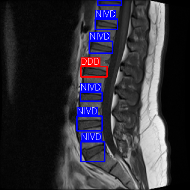</td>
<td>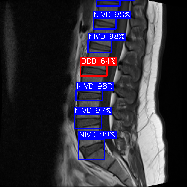</td>
<td>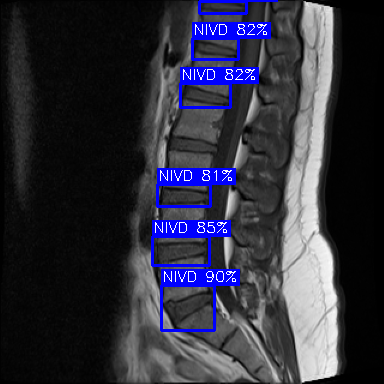</td>
</tr>
<tr>
<td>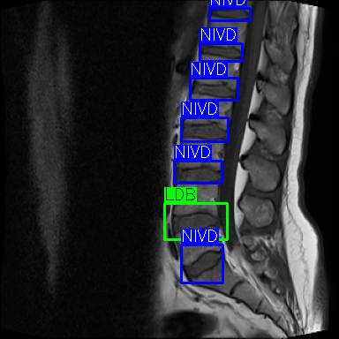</td>
<td>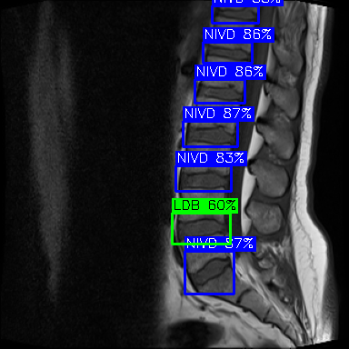</td>
<td></td>
</tr>
<tr>
<td>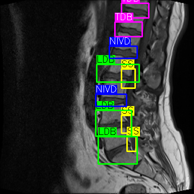</td>
<td>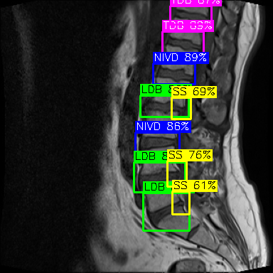</td>
<td>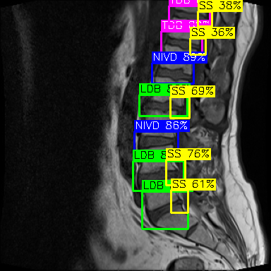</td>
</tr>
</table>
<sub><b>Qualitative Comparison.</b> YOLOspine correctly identifies overlapping pathologies (SP+LDB, SS+LDB) that the second-best baseline (YOLOv26) misses or over-predicts.</sub>
</div>

### Explainability — LayerCAM Visualizations

<div align="center">
<table>
<tr>
<td align="center">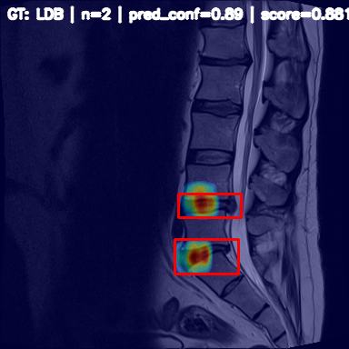<br/><sub>YOLOspine — LDB</sub></td>
<td align="center">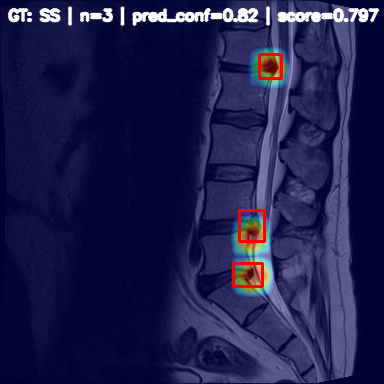<br/><sub>YOLOspine — SS</sub></td>
<td align="center"><br/><sub>YOLOspine — SP</sub></td>
<td align="center">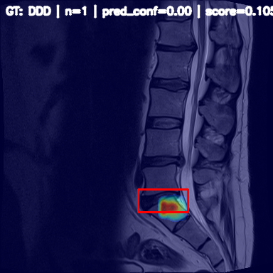<br/><sub>YOLOspine — DDD</sub></td>
<td align="center">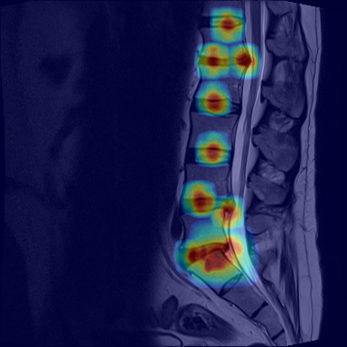<br/><sub>YOLOspine — ALL</sub></td>
</tr>
<tr>
<td align="center">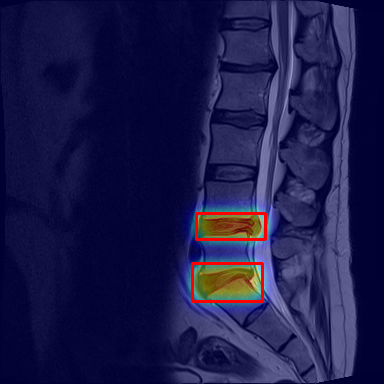<br/><sub>RT-DETR — LDB</sub></td>
<td colspan="3" align="center">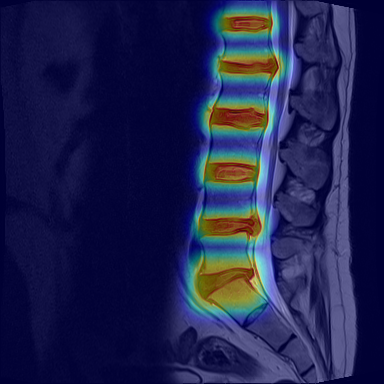<br/><sub>RT-DETR — ALL</sub></td>
<td align="center">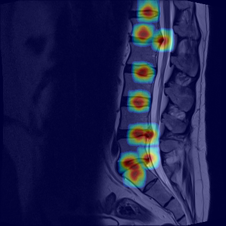<br/><sub>UNet++ — ALL</sub></td>
</tr>
</table>
<sub><b>LayerCAM Visualizations.</b> YOLOspine demonstrates superior anatomical localization — concentrated activation hotspots precisely target the IVD center and posterior annulus fibrosus for LDB, with fine discrimination between overlapping pathologies. RT-DETR shows diffuse centric activation; UNet++ fails to distinguish pathological boundaries.</sub>
</div>

### Ablation Study

| Variant | GELAN | R-ELAN | A² | MLDR | Soft-NMS | mAP₅₀₋₉₅ | Macro F1 | GPU (GB) |
|:--------|:-----:|:------:|:--:|:----:|:--------:|:---------:|:--------:|:--------:|
| **YOLOspine (Full)** | ✓ | ✓ | ✓ | ✓ | ✓ | **84.90** | **0.833** | 6.92 |
| w/o A² | ✓ | ✓ | ✗ | ✓ | ✓ | 82.13 | 0.801 | 6.70 |
| w/o R-ELAN | ✓ | ✗ | ✓ | ✓ | ✓ | 81.47 | 0.795 | 6.59 |
| w/o MLDR | ✓ | ✓ | ✓ | ✗ | ✓ | 81.09 | 0.783 | 6.60 |
| w/o Soft-NMS | ✓ | ✓ | ✓ | ✓ | ✗ | 82.65 | 0.809 | 6.92 |
| w/o A² & MLDR | ✓ | ✓ | ✗ | ✗ | ✓ | 79.82 | 0.760 | 6.55 |
| YOLOv12 (Baseline) | ✗ | ✓ | ✓ | ✗ | ✗ | 79.79 | 0.795 | 6.86 |

> The bi-staged detection head (MLDR) contributes the largest individual improvement (+3.81% mAP), while combined removal of A² and MLDR causes the most severe degradation (−5.08% mAP), confirming their synergistic interaction.

---

## Post-Detection: Meyerding Grading of Spondylolisthesis

As a post-detection step, YOLOspine performs automated **Meyerding severity grading** directly from detected SP bounding boxes. The pipeline:

1. **Crop** the detected SP region $R_i$ and resample to $128 \times 128$ pixels
2. **Extract** HOG descriptors (9 orientation bins, $8 \times 8$ cells, $2 \times 2$ blocks)
3. **Classify** using a Random Forest trained on HOG features

**Results:** 86.11% accuracy on the test split ($n_{\text{test}}=36$), correctly grading 31/36 cases.

| Grade | Count | Percentage |
|:-----:|:-----:|:----------:|
| Grade I | 93 | 76.4% |
| Grade II | 28 | 22.7% |
| Grade III | 1 | 0.9% |

<div align="center">

<br/>
<sub><b>Meyerding Grading.</b> Four quarters of the L5 inferior end-plate with Roman numerals. Displacement is measured in millimeters (mm).</sub>
</div>

---

## Repository Structure

```
yolospine/                     Core library
├── models/
│   ├── yolospine.py           V1: Single-stage with AreaAttention + DFL head
│   ├── yolospine_v2.py        V2: Two-stage (DDE + MLDR) with RoI refinement
│   └── yolospine_v33.py       V3.3: DenseC2f + adaptive LayerNorm + AreaAttention
├── data/
│   └── dataset.py             SpinalMRIDataset with Meyerding grading support
├── losses/
│   ├── detection_loss.py      TaskAlignedAssigner, BboxLoss (CIoU + DFL)
│   └── two_stage_loss.py      FocalLoss, QualityFocalLoss, Stage-1/Stage-2 losses
└── utils/
    ├── decode.py              Multi-scale prediction decoding + NMS
    ├── metrics.py             mAP (101-point interpolation), Precision, Recall
    ├── pfirrmann.py           Metadata utilities
    └── visualization.py       Detection drawing and plotting

tools/                         CLI scripts
├── train.py                   Unified training (V1 / V2 / V33)
├── evaluate.py                Evaluation with mAP, per-class metrics
├── inference.py               Single-image / batch inference
├── run_benchmark.py           YOLO v8–v12/v26 + RT-DETR benchmark
└── convert_yolo_to_coco.py    YOLO → COCO format conversion

baselines/                     Comparison methods
├── segmentation_models.py     UNet++, SwinUNet, TransUNet via SMP
├── train_baseline.py          Segmentation baseline training
├── train_rtdetr.py            RT-DETR fine-tuning (Ultralytics)
└── detectron2/
    ├── train.py               Cascade R-CNN (R50-FPN) training
    └── evaluate.py            Full detection + classification evaluation

external_validation/           Cross-domain evaluation
├── evaluate.py                External dataset metrics
├── gradcam.py                 GradCAM / GradCAM++ / LayerCAM
└── robustness.py              MRI degradation simulator (6 corruption types)

analysis/                      Paper-supporting analysis
├── model_specs.py             Computational table (Params, GFLOPs, GPU VRAM)
├── threshold_analysis.py      Variable IoU thresholds per pathology pair
├── extract_metrics.py         Best metric extraction from training runs
└── plots/
    ├── confusion_matrix.py    7×7 confusion matrix visualization
    └── metrics_comparison.py  Grouped bar charts

configs/                       YAML dataset configurations
├── data_disorders.yaml        6-class disorder detection
└── data_pfirrmann.yaml        13-class (anatomy + disorders)

assets/                        Figures and visualizations
tests/                         Unit tests
docs/                          Architecture diagrams (PDF)
```

---

## Installation

### Prerequisites

- Python ≥ 3.10
- CUDA-compatible GPU (tested on NVIDIA RTX 4070, 8 GB VRAM)
- [Conda](https://docs.conda.io/en/latest/miniconda.html) (recommended)

### Setup

```bash
# Clone repository
git clone https://github.com/farhatmasood/YOLOspine.git
cd YOLOspine

# Create environment
conda env create -f environment.yml
conda activate YS

# Install YOLOspine as editable package
pip install -e .

# (Optional) Install all extras including Ultralytics, SMP, etc.
pip install -e ".[all]"
```

### Optional Dependencies

```bash
# Detectron2 (CUDA 11.8, PyTorch 2.0)
pip install detectron2 -f https://dl.fbaipublicfiles.com/detectron2/wheels/cu118/torch2.0/index.html

# RF-DETR
pip install rfdetr
```

---

## Dataset Preparation

### Internal Dataset

Download the [publicly available multi-disorder dataset](https://data.mendeley.com/datasets/9j9hmy8kbn/1) (1,038 MRI images, 8,991 annotations):

```
data/
├── images/
│   ├── train/    (726 images)
│   ├── val/      (207 images)
│   └── test/     (105 images)
└── labels/
    ├── train/    (726 label files)
    ├── val/      (207 label files)
    └── test/     (105 label files)
```

Each label file follows YOLO format — one annotation per line:
```
class_id  cx  cy  w  h
```
where coordinates are normalized to `[0, 1]`.

### External Dataset (RSNA 2024 Derivative)

For cross-validation, 300 mid-sagittal T2-weighted images were extracted from the [RSNA 2024 Lumbar Spine Degenerative Classification](https://www.kaggle.com/competitions/rsna-2024-lumbar-spine-degenerative-classification/data) dataset. Distribution in external dataset:

| Disorder | Instances | Percentage |
|:---------|:---------:|:----------:|
| IVDₙ | 843 | 32.90% |
| SS | 645 | 25.15% |
| LDB | 556 | 21.69% |
| DDD | 357 | 13.93% |
| TDB | 89 | 3.49% |
| SP | 72 | 2.84% |

### COCO Format Conversion (for Detectron2 / RF-DETR)

```bash
python tools/convert_yolo_to_coco.py \
    --dataset-dir data/ --output-dir data_coco/
```

---

## Usage

### Training YOLOspine

```bash
# V3.3 (recommended — highest performance)
python tools/train.py --model v33 \
    --data configs/data_disorders.yaml \
    --epochs 200 --batch 32 --img-size 384 \
    --lr 1e-4 --optimizer adamw

# V2 (two-stage architecture)
python tools/train.py --model v2 \
    --data configs/data_disorders.yaml

# V1 (single-stage baseline)
python tools/train.py --model v1 \
    --data configs/data_disorders.yaml
```

### Evaluation

```bash
python tools/evaluate.py --model v33 \
    --weights checkpoints/best.pt \
    --data configs/data_disorders.yaml \
    --split test --visualize
```

### Inference

```bash
# Single image
python tools/inference.py --model v33 \
    --weights checkpoints/best.pt \
    --input path/to/mri.png --output results/

# Batch inference on directory
python tools/inference.py --model v33 \
    --weights checkpoints/best.pt \
    --input path/to/images/ --output results/
```

### Benchmark All Baselines

```bash
# Train all YOLO v8–v12/v26 + RT-DETR with identical hyperparameters
python tools/run_benchmark.py \
    --data configs/data_disorders.yaml \
    --epochs 200 --batch 32 --imgsz 384

# Segmentation baselines (UNet++, SwinUNet, TransUNet)
python baselines/train_baseline.py \
    --model unetpp --data configs/data_disorders.yaml

# Detectron2 Cascade R-CNN
python baselines/detectron2/train.py \
    --train-json data_coco/train.json \
    --val-json data_coco/val.json \
    --image-dir data/images/
```

### External Validation

```bash
python external_validation/evaluate.py \
    --model-type yolospine_v33 \
    --weights checkpoints/best.pt \
    --images /path/to/rsna_images/ \
    --labels /path/to/rsna_labels/
```

### Explainability (GradCAM / LayerCAM)

```python
from yolospine.models import YOLOspineV33
from external_validation.gradcam import GradCAM, visualize_gradcam
import torch

model = YOLOspineV33(num_classes=6)
model.load_state_dict(torch.load("checkpoints/best.pt"))
model.eval()

gradcam = GradCAM(model)
heatmap, meta = gradcam.generate(input_tensor, class_idx=4)  # LDB
overlay = visualize_gradcam(image_bgr, heatmap)
gradcam.remove_hooks()
```

### Robustness Testing

```python
from external_validation.robustness import RobustnessEvaluator

evaluator = RobustnessEvaluator(model.predict)
results = evaluator.evaluate_robustness_suite(image_bgr)
# Tests: Gaussian noise, Rician noise, Motion blur, B1 bias field,
#        Gibbs ringing, Contrast variation (6 degradation types)
```

### Meyerding Grading (Post-Detection)

```python
from yolospine.utils.pfirrmann import get_pfirrmann_grade
# Automated severity grading via HOG + Random Forest
# Applied to detected SP bounding boxes
```

---

## Experimental Configuration

| Parameter | Value |
|:----------|:------|
| Input Resolution | 384 × 384 |
| Batch Size | 32 |
| Epochs | 200 |
| Optimizer | AdamW |
| Learning Rate | 1 × 10⁻⁴ (cosine annealing) |
| Backbone LR | 5 × 10⁻⁵ (optional fine-tuning) |
| Weight Decay | 1 × 10⁻² |
| Mixed Precision | FP16 |
| Gradient Clipping | 10.0 |
| GPU | NVIDIA RTX 4070 (8 GB) |
| Framework | PyTorch 2.0+ / Python 3.10 |

**Augmentation Strategy:**
- Minor rotation, horizontal flips, intensity variations
- Gaussian blur (emulating noisy MRI acquisition)
- Rician noise (reflecting native MRI noise distribution)
- Uniform motion blur (simulating respiration / patient movement)
- Class-centric augmentation with frequency-inverse weighting:

$$w_c = \frac{1}{f_c + \epsilon}, \quad \hat{w}_c = \frac{w_c}{\sum_{k=1}^{C} w_k}, \quad A_c = \hat{w}_c \cdot A_{\text{total}}$$

---

## Citation

If you use this code or dataset in your research, please cite:

```bibtex
@article{masood2026yolospine,
  title     = {A Clinically Validated Hierarchical Two-Stage Attention-Enhanced 
               Architecture for Multi-Label Overlapping Spinal Disorder Detection},
  author    = {Masood, Rao Farhat and Taj, Imtiaz Ahmad},
  journal   = {IEEE Transactions on Medical Imaging},
  year      = {2026},
  volume    = {XX},
  number    = {XX},
  pages     = {XX--XX},
  doi       = {10.1109/TMI.2026.XXXXX}
}

@misc{masood2025dataset,
  title     = {Multi-disorder annotations for lumbar spine mid-sagittal images},
  author    = {Masood, Rao Farhat and Taj, Imtiaz Ahmad and Talha, M. and Khan, M. B.},
  year      = {2025},
  publisher = {Mendeley Data},
  version   = {v1},
  doi       = {10.17632/9j9hmy8kbn.1},
  url       = {https://data.mendeley.com/datasets/9j9hmy8kbn/1}
}

@inproceedings{masood2022vertebral,
  title     = {Deep learning based vertebral body segmentation with extraction 
               of spinal measurements and disorder disease classification},
  author    = {Masood, Rao Farhat and Taj, Imtiaz Ahmad and Khan, M. B. 
               and Qureshi, M. A. and Hassan, T.},
  journal   = {Biomedical Signal Processing and Control},
  volume    = {71},
  pages     = {103230},
  year      = {2022},
  doi       = {10.1016/j.bspc.2021.103230}
}
```

---

## License

This project is licensed under the [MIT License](LICENSE).

---

## Acknowledgements

We are sincerely thankful to the panel of volunteer clinical experts from radiology and spinal surgery for rendering their help throughout the course of this research.
